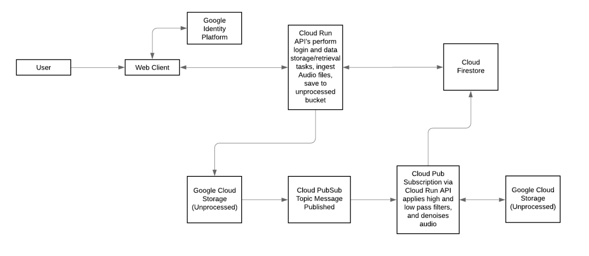

# project-bch-als-msg-banking

Boston Children's Hospital ALS Message Banking Project (Double Dipping Audio Editor)

Speech impairment is common in patients with ALS. The ALS Message Banking Project aims to preserve their voice and assist them with their needs.
The platform allows the user to login to their own dashboard where they can upload and retrieve audio files securely. The ultimate goal is to have these audio files processed and filtered automatically to enhance their sound quality and be able to reuse parts of the audio clips to produce a new "voice" for the user.

## Technical Architecture



- Frontend:
  - React.js
- Backend:
  - Flask Python
  - Cloud Functions to process audio clips
- Database:
  - Firestore to store user information
  - Google Cloud Storage for audio files

## Running the Application

Follow the steps below to start the application

## Frontend

`cd client`

### Run Frontend Locally

`npm install`

`npm start`

### To Deploy Frontend

Push to `main` or create a PR to main to see the deployed website. CI/CD deploys to Firebase Hosting. The frontend is accessible at [als-message-banking.web.app/](https://als-message-banking.web.app/)right now.

## Backend

`cd backend`

### Run Backend Locally

- Setup GOOGLE_APPLICATION_CREDENTIALS as described here - <https://cloud.google.com/docs/authentication/getting-started>

```bash
docker build -t als-backend .
docker run als-backend
```

### To Deploy Backend

Backend is deployed to GCP. After authenticating docker to push to the private docker repository, run the following commands to deploy the API.

```bash
docker build -t us-docker.pkg.dev/als-message-banking/docker/api-dev:latest .
docker push us-docker.pkg.dev/als-message-banking/docker/api-dev:latest
gcloud run deploy api-dev \
--image=us-docker.pkg.dev/als-message-banking/docker/api-dev:latest \
--platform=managed \
--region=us-central1 \
--project=als-message-banking
```

## Known Bugs and Future Steps

### Issues

[Click Here](https://github.com/BU-Spark/se-bch-als-msg-banking/issues) to view the list of bugs and feature suggestions.

### Next Step - Enhance Audio Processing Features

- Further develop the audio processing script to accommodate for slur and unclear subject voice
  - Develop different filters to process voice clips
    - Setup Admins with the ability to edit voice clips
- Synthesize voice clips
